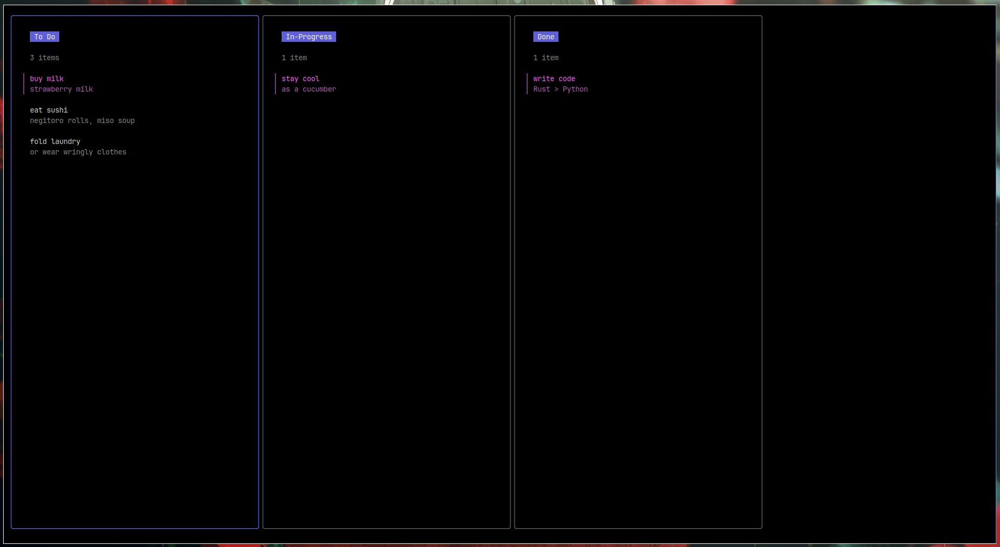

# CLI - Kanban Board

## Overview
This is a simple kanban board for the CLI written in Go with the help of 
[Bubble Tea](https://github.com/charmbracelet/bubbletea) TUI-framework, 
[Bubbles](https://github.com/charmbracelet/bubbles) components-library and 
[Lipgloss](https://github.com/charmbracelet/lipgloss) styling definition from
[Charm.sh](https://charm.sh/).



## Setup and Installation
Make sure to have Go v1.8 or higher installed on your system for this program 
to run.
```bash
# Using the Git CLI
git clone https://github.com/IAmRiteshKoushik/go-cli-kanban

# (or) Using the GitHub CLI
gh repo clone IAmRiteshKoushik/go-cli-kanban
```
Installation of necessary modules
```bash
# Fetching all modules
go mod tidy

# Running the program
go run .
```


## Usage Instructions
```bash
# Move left
> h (key)
# Move right
> l (key)
# Complete task
> Enter (key)
# Create task
> n (key)
# Quit the program
> q
```

## Existing features:
- [X] Create a task in any list - Not Started, In Progress, Done
- [X] Move tasks between lists

## Some good extensions
- [ ] Add filtering functionality within lists
- [ ] If a list becomes empty, the program crashes
- [ ] Convert the CLI to a TUI for better navigation

